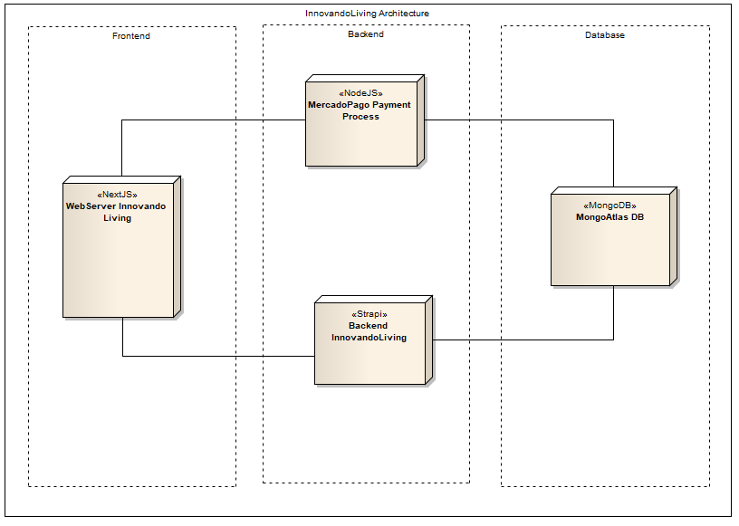

# InnovandoLiving Front-End - (e-Commerce Website)

This is an eCommerce project for InnovandoLiving business in Argentina. InnovandoLiving is a Furniture seller and Armchair manufacturer pretty famous in Buenos Aires.

# Architecture 

* [NodeJS Backend MercadoPago](https://github.com/dguglielmi-git/innovandoliving-mercadopago) - Backend project for payment processing through the gateway of MercadoPago.
* [Strapi Backend](https://github.com/dguglielmi-git/innovandoliving-backend) - Backend project required for website administration, CRUD of Products, system settings, etc.
## Getting Started 🚀

Have a look at 'How to Install' to proceed with the installation

### Pre-requisites 📋

It is required to have installed NodeJS.

### How to Install 🔧

Pending adding detail of installation.

## Deploy 📦

Pending details of deploy

## Built with 🛠️

* [NextJS](https://nextjs.org/docs/getting-started) - The React Framework for Production.
* [Strapi](https://strapi.io/resource-center) - Design APIs fast, manage content easily.
* [FontAwesome](https://fontawesome.com/) - Vector icons and social logos on your website.
* [React Bootstrap](https://react-bootstrap.github.io/) - The most popular front-end framework.
* [MaterialUI](https://material-ui.com/) - React components for faster and easier web development.
* [PrimeReact - PrimeFaces](https://www.primefaces.org/primereact/) - The ultimate collection of design-agnostic, flexible and accessible React UI Components.
* [SemanticUI](https://semantic-ui.com/) - Development framework that helps create beautiful, responsive layouts using human-friendly HTML.
* [Jwt-Decode](https://www.npmjs.com/package/jwt-decode) - small browser library that helps decoding JWTs token which are Base64Url encoded.
* [react-country-flag](https://www.npmjs.com/package/react-country-flag) - React component for emoji/svg country flags.
* [react-toastify](https://www.npmjs.com/package/react-toastify) - React-Toastify allows you to add notifications to your app with ease. No more nonsense!
* [react-scrollable-feed](https://www.npmjs.com/package/react-scrollable-feed) - Smart scrolling for chat UIs and feeds.
* [react-player](https://www.npmjs.com/package/react-player) - A React component for playing a variety of URLs, including file paths, YouTube, Facebook, Twitch, SoundCloud, Streamable, Vimeo, Wistia, Mixcloud, DailyMotion and Kaltura.
* [Formik](https://formik.org/) - Formik is the world's most popular open source form library for React and React Native.
* [Yup](https://yarnpkg.com/package/yup) - Dead simple Object schema validation.
* [Internationalization i18n](https://react.i18next.com/) - react-i18next is a powerful internationalization framework for React / React Native which is based on i18next.
* [lodash](https://lodash.com/) - A modern JavaScript utility library delivering modularity, performance & extras.
* [SaSS](https://sass-lang.com/) - Sass is the most mature, stable, and powerful professional grade CSS extension language in the world.

## Version 📌

We used [SemVer](http://semver.org/) for versioning. Check out the whole version list available [tagsRepo](https://github.com/dguglielmi-git/innovandoliving/tags).

## Author ✒️

* **Daniel Guglielmi** - *Designer, Architect, Front-End, Backend, Documentation, Translator* - [dguglielmi-git](https://github.com/dguglielmi-git)

## License 📄

No license required.

## Thanks 🎁

* To the owners of InnovandoLiving for choosing me for this project.

---
⌨️ with ❤️ by [dguglielmi-git](https://github.com/dguglielmi-git) 😊